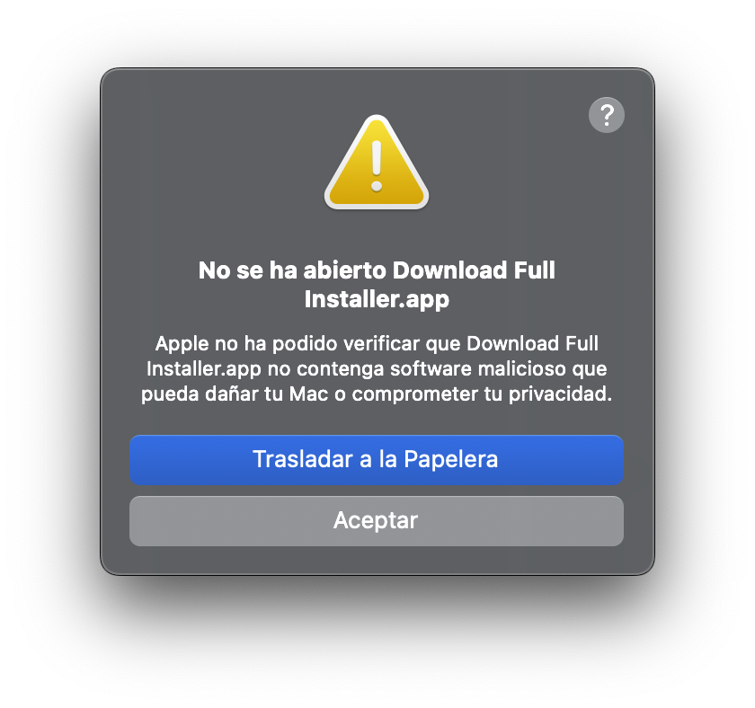
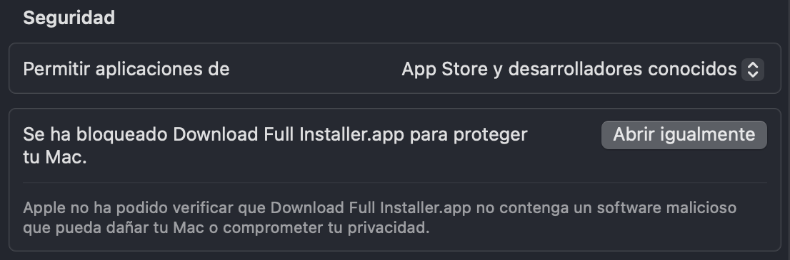

# La aplicación descargada no se puede abrir

Las condiciones que Apple impone para mantener la seguridad y privacidad del usuario son cada vez más estrictas. Esto, por supuesto, beneficia a los usuarios, pero también tiene sus inconvenientes.

Al descargar un archivo de Internet, se le añade un atributo extendido llamado `com.apple.quarantine` para que Gatekeeper solicite confirmación antes de ejecutarlo.

En versiones anteriores a Sequoia, la advertencia de Gatekeeper para archivos descargados de Internet tenía una solución sencilla: aceptar la advertencia al abrir el archivo o hacer clic derecho sobre él >> Abrir.

Pero en Sequoia y Tahoe, la advertencia es más seria y puede asustar al usuario. Puede mostrar este mensaje:
<br>`La aplicación está dañada y no se puede abrir.`<br>
O este otro:
<br>`No se ha podido verificar que Download Full Installer no contenga software malicioso.`<br>
Con la recomendación en ambos casos de trasladar el archivo a la Papelera.



Esta es la advertencia que aparece cuando la aplicación no está firmada digitalmente ni notarizada por Apple, en cuyo caso la advertencia es más benigna, similar a las versiones anteriores a Sequoia.

Actualmente, se requiere una cuenta de desarrollador de Apple para firmar digitalmente o notarizar aplicaciones. Sin embargo, muchos desarrolladores no quieren registrarse en el Programa para Desarrolladores de Apple, ya sea por el coste o porque desarrollan pequeñas aplicaciones que se distribuyen gratuitamente.

Este es el caso de muchas de las aplicaciones que publicamos de forma amateur, firmadas ad hoc y sin notarizar. Aunque el código fuente de este tipo de aplicaciones suele estar disponible y se puede explorar para determinar si existen condiciones que debiliten la seguridad, esta advertencia puede generar sospechas.

Los usuarios que tengan Gatekeeper desactivado no verán esta advertencia. Sin embargo, desactivar Gatekeeper globalmente para ejecutar una sola aplicación no es una recomendación válida.

¿Cómo solucionar este problema?

## Configuración del sistema >> Seguridad y privacidad

Primero, ve a "Privacidad y seguridad" para ver si hay un mensaje que indica que la aplicación descargada está bloqueada con la opción "Abrir de todas formas". Esta es la forma más sencilla de solucionarlo.

<kbd>

</kbd>
<br><br>
Al hacer clic en "Abrir de todas formas", macOS volverá a preguntar si desea abrir el archivo y, si responde que sí, solicitará la contraseña de usuario y lo abrirá.

## Herramienta de línea de comandos xattr

`xattr` gestiona los atributos extendidos (*xattrs*), que son metadatos adicionales adjuntos a archivos y directorios, además de la información estándar como el nombre o el tamaño. Esta herramienta está integrada en macOS de forma nativa. Con `xattr` puedes eliminar el atributo `com.apple.quarantine` de cualquier archivo descargado de Internet; la tarea es bastante sencilla.

- `xattr` sin argumentos muestra los atributos extendidos:

```
> sudo xattr /Applications/Download\ Full\ Installer.app
> com.apple.quarantine
```

- `xattr -cr` elimina todos los atributos extendidos:

`> sudo xattr -cr /Applications/Download\Full\Installer.app`

- Después de este comando, `xattr` ya no muestra el atributo extendido `com.apple.quarantine`:

```
> sudo xattr /Applications/Download\Full\Installer.app
> (sin salida)
```

## Editor Xattr

El Editor Xattr es una sencilla aplicación GUI para ver/editar atributos extendidos de archivos en macOS. Cuenta con su propio [**repositorio**](https://github.com/perez987/Xattr-Editor).

## Resultado

En cualquier caso, ya sea por Ajustes del Sistema, Editor Xattr o `xattr`, a partir de este momento la aplicación descargada se ejecutará sin avisos de seguridad, ya que se ha eliminado el atributo `com.apple.quarantine`.
