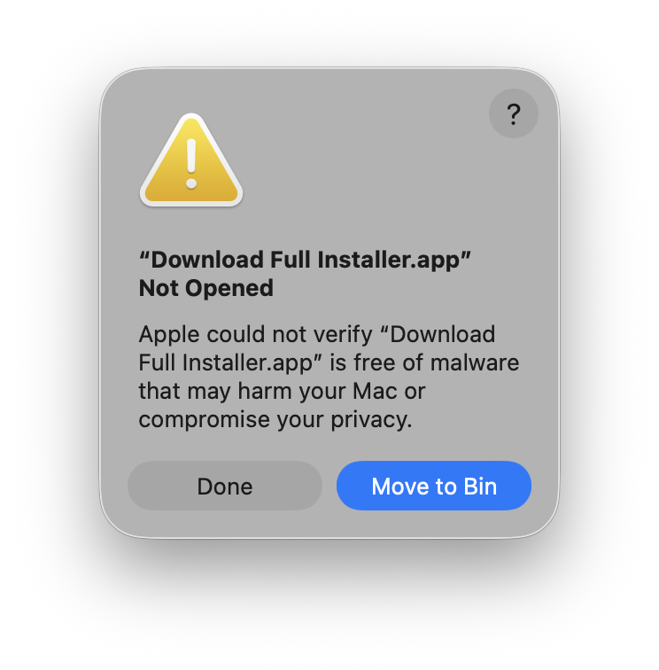
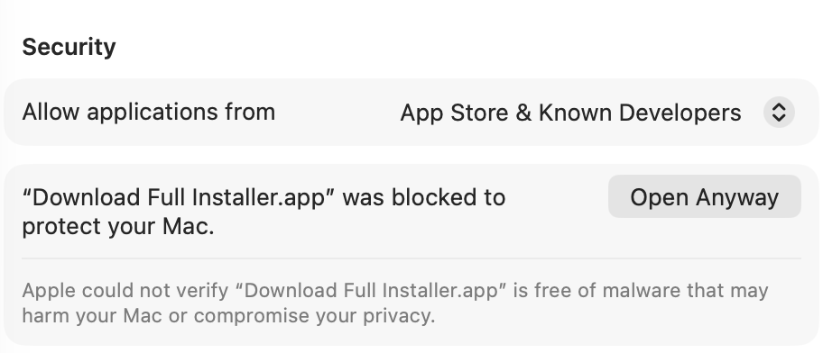

# App is damaged and can't be opened

The conditions Apple imposes to maintain user security and privacy are becoming increasingly strict. This, of course, benefits users but it has drawbacks.

When a file is downloaded from the Internet, an extended attribute named `com.apple.quarantine` is added to it so that Gatekeeper requests confirmation before executing them.

In pre-Sequoia versions, the Gatekeeper warning for files downloaded from the Internet had a simple solution: accepting the warning when opening the file or right-clicking on the file >> Open.

But in Sequoia and Tahoe, the warning is more serious and might upset the user. It may display this message:
<br>`The application is damaged and cannot be opened.`<br>
Or this one:
<br>`Could not verify that Download Full Installer does not contain malicious software.`<br>
With the recommendation in both cases to move the file to the Trash.

For example, in the first opening of Download Full Installer you can see:



This is the warning that appears when the app is not digitally signed or notarized by Apple; in which case, the warning is more benign, reminiscent of the pre-Sequoia versions.

Currently, an Apple Developer account is required to digitally sign or notarize Mac applications. However, many developers don't want to register with the Apple Developer Program, either because of the cost or because they develop small apps that are distributed for free.

This is the case with many of the apps we publish as amateurs, signed ad-hoc and not notarized. Although the source code for these types of applications is usually available and can be explored to determine if there are conditions that weaken security, this warning may raise some suspicions. 

Users who have Gatekeeper disabled will not see this warning. However, disabling Gatekeeper globally to run a single application is not a valid recommendation.

How to fix this issue?

## System Settings >> Security and Privacy

First, go to `Privacy & Security` to see if there's a message about blocking the downloaded application with `Open Anyway `option. This is the easiest way to fix it.

<kbd>

</kbd>
<br><br>
By clicking `Open Anyway`, macOS will ask again if you want to open the file and, if you answer yes, it will ask for the user password and open it. 

## xattr command line tool

`xattr`handles extended attributes (*xattrs*), which are additional metadata attached to files and directories beyond standard information like name or size. This tool is built into macOS natively. With `xattr` you can remove the `com.apple.quarantine` attribute from any file downloaded from Internet and the task is quite simple.

- `xattr` without arguments displays extended attributes:

```
> sudo xattr /Applications/Download\ Full\ Installer.app
> com.apple.quarantine
```

- `xattr -cr` removes all extended attributes:

`> sudo xattr -cr /Applications/Download\ Full\ Installer.app`

- After this command, `xattr` no longer displays `com.apple.quarantine` extended attribute:

```
> sudo xattr /Applications/Download\ Full\ Installer.app 
> (no output)
```

## Xattr Editor

Xattr Editor is a simple GUI application to view/edit extended file attributes on macOS, it has their own [**repository**](https://github.com/perez987/Xattr-Editor).

## Result

Either way, System Settings, Xattr Editor or `xattr`, from this point on, the downloaded app will run without security prompts because the `com.apple.quarantine` attribute has been removed.
