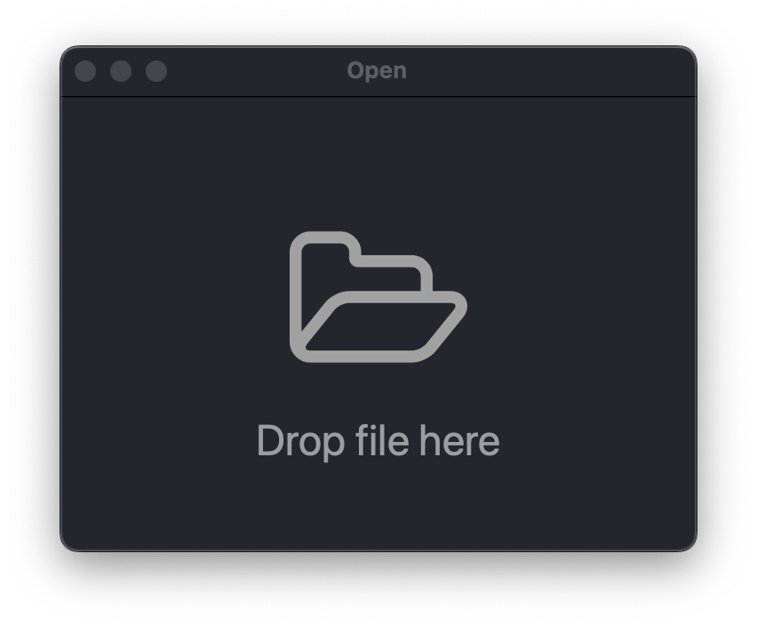
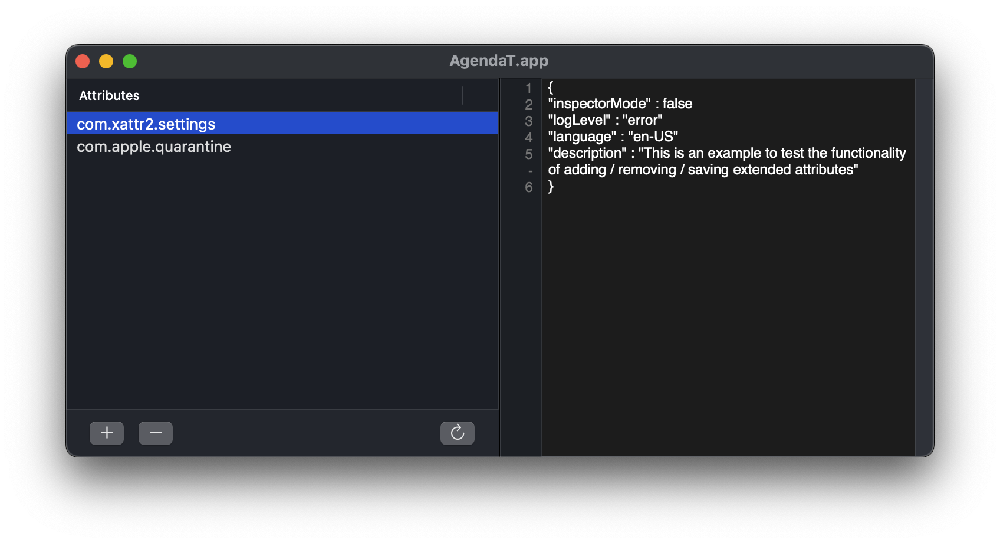
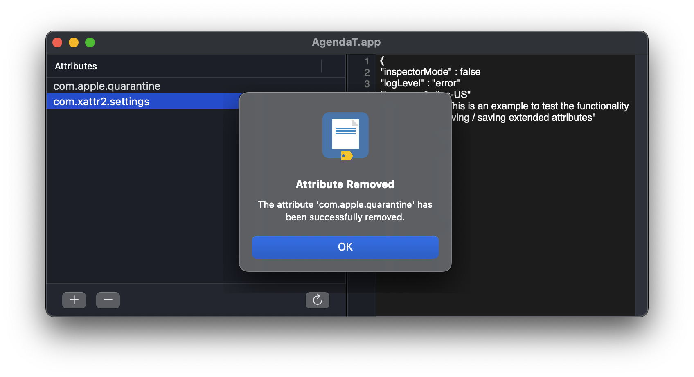

# Xattr Editor

Xattr Editor is a simple GUI application to view/edit extended file attributes on macOS, for those users who might find a graphical interface more convenient—where they can drag and drop a file and view its extended attributes—rather than opening Terminal and interacting with `xattr`. With the added advantage that attributes can be edited one by one, adding, modifying, or deleting any of them.

The drawback of Xattr Editor is that, as an application downloaded from the internet, it also displays the Gatekeeper warning on its first run. This is unavoidable since the app is only ad-hoc signed and not notarized. This doesn't happen if you download the source code, compile the app using Xcode, and save the product for regular use.

This [document](DOCS/App-damaged.md) expands on the information about the security warning in files downloaded from the Internet, and 3 ways to fix it: Security and Privacy, `xattr` command line tool and **Xattr Editor**.

## Xattr Editor how-to 

It's really simple to use. When you start the app, a window appears where you can drag and drop files.

You can also use the File >> Open menu (Cmd + O), which allows you to select a file instead of dragging it onto the window. Either way, the main window opens with the extended attribute(s) (if any) and their properties.

You can add, rename, delete, or modify properties of existing attributes.

When removing an attribute, the user receives feedback. E.g., removing the com.apple.quarantine attribute:

